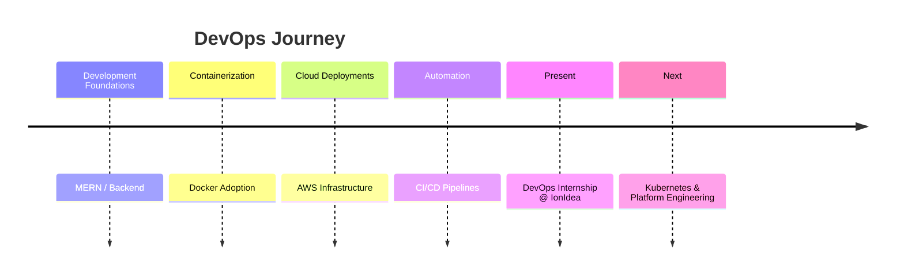

<div align="center">


<br/>


</div>

---

# ⚡ DevOps Control Panel

```bash
> role: DevOps Engineer Intern
> company: IonIdea
> focus: Automation | Reliability | Cloud Infrastructure
> mindset: "Assume Failure. Automate Recovery."
```

---

## 👨‍💻 About Me

I’m **Ketan Ayatti**, a DevOps Engineer Intern passionate about building **production-grade infrastructure** rather than just applications.

My curiosity lies in answering:

* What happens when deployments fail?
* How systems recover automatically?
* How infrastructure scales securely?
* How downtime becomes invisible?

I build systems that are:

✅ Containerized
✅ Automated
✅ Secure
✅ Recoverable
✅ Cloud-Ready

---

## 🧭 Engineering Journey



---

## 🛠️ Tech Stack Radar

<div align="center">


</div>

---

# 🏗️ DevOps Architecture Mindset

<div align="center">

```
Developer Push
      │
      ▼
 CI/CD Pipeline
      │
      ▼
 Container Build
      │
      ▼
 Cloud Infrastructure
      │
      ▼
 Load Balancer
      │
      ▼
 Self-Healing Services
```

</div>

---

# 🚀 Flagship DevOps Projects (2026)

---

## 🤖 Autonomous Self-Healing Deployment Platform

⚙️ Zero downtime deployments
🔁 Automatic rollback engine
📊 Health-check driven recovery

**Concepts**

* Blue-Green Deployment
* Failure Detection
* Auto Recovery Logic
* Infrastructure Automation

---

## 🛡️ DevSecOps Hardening Lab

Simulating real-world attacks to design secure infrastructure.

Includes:

* Container exploitation lab
* Image hardening
* Runtime defense testing
* Security misconfiguration analysis

---

## ⚙️ Lightweight Platform Engineering Mini-PaaS

Internal developer platform enabling:

✅ One-command deployments
✅ Service routing
✅ Container lifecycle automation
✅ Internal hosting platform

---

# 🌐 Production Deployments

### 🔒 Communiatec

Cloud-native collaboration system deployed using AWS + Docker.

### 💬 Chatzy

Containerized real-time chat platform with production configuration.

---

# 📊 Engineering Metrics

<div align="center">


</div>

---

# 📈 Learning & Upgrade Tracker

| Area               | Status             |
| ------------------ | ------------------ |
| Terraform          | ✅ Active           |
| AWS Infrastructure | ✅ Active           |
| Docker             | ✅ Production Usage |
| Kubernetes         | 🔄 Learning        |
| Observability      | ⏳ Upcoming         |
| DevSecOps          | 🔄 Active          |

---

# 🧩 Engineering Principles

```yaml
automation: mandatory
manual_work: minimized
security: default
downtime: unacceptable
monitoring: required
infrastructure: version-controlled
```

---

<div align="center">

### ⚡ Philosophy

"Great engineers build systems that continue working when they are asleep."

</div>


